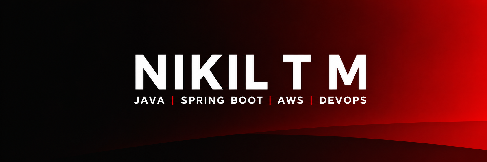
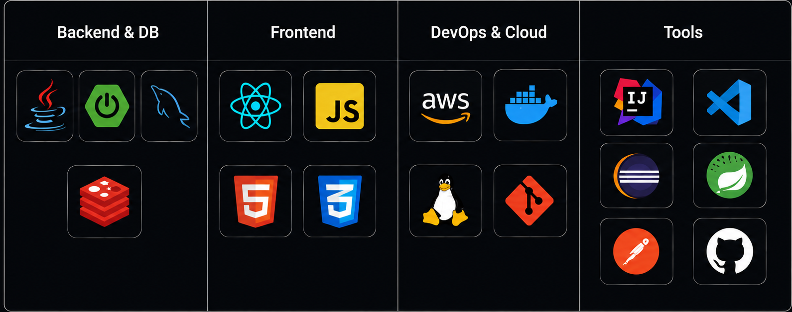

<p align="center">
<p align="center">
  
</p>


<div align="center">

[](https://git.io/typing-svg)

</div>

## 👨‍💻 ABOUT THE DEVELOPER

<table>
<tr>
<td width="60%">

Hi! I'm **Nikil T M** — a Backend Developer passionate about building scalable and reliable applications. I enjoy solving real-world problems through clean architecture, efficient APIs, and cloud technologies.

- ⚡ **Role:** Backend Engineer
- ☕ **Core:** Java, Spring Boot, SQL
- ☁️ **Current Focus:** AWS Cloud, DevOps, System Design
- 🐧 **Environment:** Linux & Backend Development
- 📚 **Learning:** Advanced AWS Services & CI/CD
- 🤝 **Open To:** Collaboration, Open Source & Backend Projects

</td>

<td width="40%">


</td>
</tr>
</table>

## ☠️ TECH ARSENAL

<p align="center">
  
</p>

---
# 🚀 SYSTEM STATUS

```yaml
Status: ONLINE
Role: Backend Engineer
Primary Language: Java
Framework: Spring Boot
Database: PostgreSQL
Cloud: AWS
Operating System: Linux
Current Mission: Master AWS & DevOps
Focus Area: Scalable Backend Systems
```


## 📊 GITHUB ANALYTICS

<p align="center">
  
  
</p>


## 🔥 CONTRIBUTION GRAPH

[](https://github.com/nikil1717)


## 📫 CONNECT WITH ME

<p align="center">

<a href="https://www.linkedin.com/in/nikil-t-m-131006255/">

</a>

<a href="mailto:nikilgowda171@gmail.com">

</a>

<a href="https://leetcode.com/u/NikilGowda17/">

</a>

<a href="https://github.com/nikil1717">

</a>

</p>

---

<div align="center">

### 🚀 BUILDING SCALABLE BACKEND SYSTEMS

*Code • Deploy • Scale*

</div>
